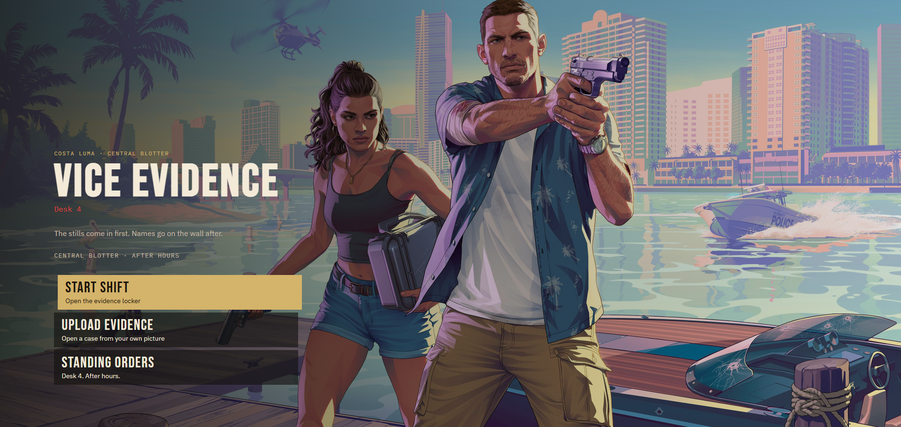
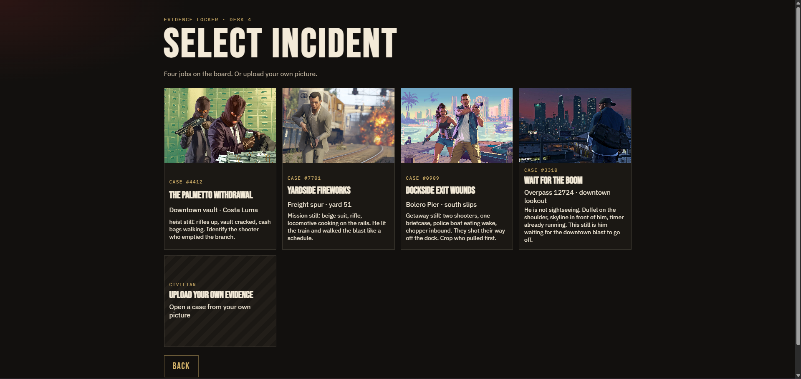
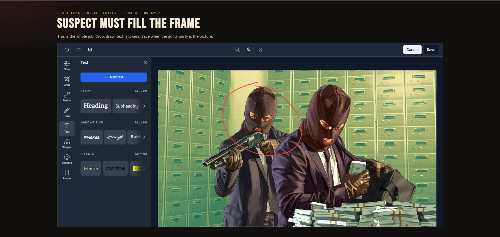
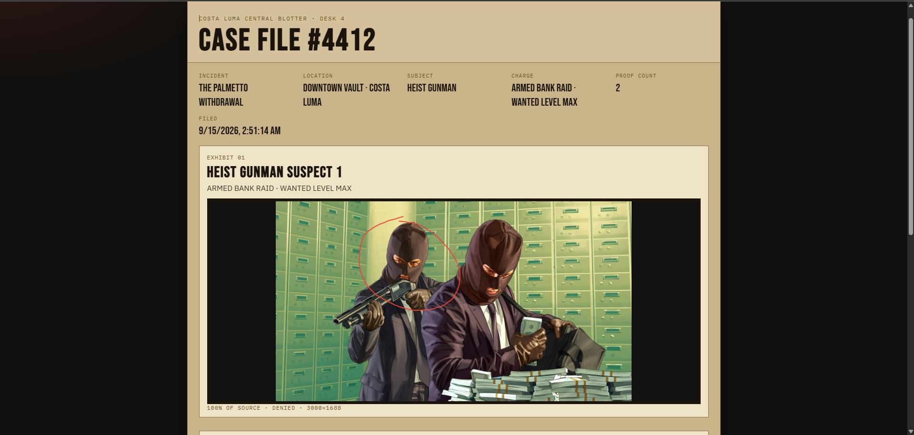

# Vice Evidence — Costa Luma Central Blotter

> *"Costa Luma Central Blotter does not investigate. They crop. Whoever fills the frame did it."*

A retro-cinematic, satirical police blotter micro-game built for the **Unlayer Build With Image Editor Challenge**. 

In Costa Luma, detectives don't run forensics or question witnesses. Desk 4 takes surveillance stills from heists, train bombings, and pier shootouts, crops directly onto the perpetrator using **Unlayer's React Image Editor**, and files the result into a wanted dossier.

Repo: [https://github.com/raghul-tech/Vice-Evidence.git](https://github.com/raghul-tech/Vice-Evidence.git)

[](https://app.netlify.com/projects/vice-evidence/deploys)

---

## 🌴 Concept & GTA VI Inspiration

*Vice Evidence* is inspired by the satirical world, neon aesthetic, and criminal chaos of GTA Vice City and the upcoming GTA VI:

- **The Lore:** You are an evidence clerk at Desk 4 of the Costa Luma Central Blotter. Policy is simple: *"If the whole bank vault still fits in the JPEG, you have not found the thief."*
- **Aesthetic & Tone:** 
  - Keyboard-navigable boot menu (`W` / `S` / Arrow keys + `Enter`).
  - GTA-style cinematic transition screens with spinning loading wheels and concept art.
  - Gritty police blotter typography (`Bebas Neue` and `IBM Plex Mono`).
  - Dark humor in case files, officer quotes, and incident descriptions.

---

## ✂️ How React Image Editor is Used

The `@unlayer/react-image-editor` package is not just a UI tool here—it is the **core gameplay and accusation mechanic**:

1. **The Crop Desk:** The editor is loaded in dark mode inside `CropDesk.jsx` with left-docked editing tools.
2. **Guilt-by-Crop Verdict Engine:** When you click save in the editor, `measureCrop` (`src/game/verdict.js`) calculates the pixel area of your crop relative to the original source image:
   - **≤ 30% area:** `WANTED` (Tight crop on suspect — immediate guilty verdict)
   - **31% – 60% area:** `POSSIBLE SUSPECT` (Needs tighter framing)
   - **61% – 90% area:** `INSUFFICIENT EVIDENCE` (Too much background/scene)
   - **> 90% area:** `DENIED` (*"You submitted the whole branch. Do your job."*)
3. **Tools & Annotations:** In addition to cropping, detectives can use the editor's text, pen/drawing, stickers, and filter tools to mark evidence.
4. **Case File Filing:** Once cropped and labeled, each exhibit is filed with its crop ratio, dimensions, and verdict into an authentic detective case folder.

---

## 🕹️ Game Flow

```
Boot Menu ──► Loading Screen ──► Evidence Locker ──► Case Briefing ──► Crop Desk (Unlayer) ──► Label Exhibit ──► Case File Dossier
   │                                   │                                                                               │
   └────────── Upload Civilian JPEG ───┘                                                          Print / Add More ────┘
```

1. **Boot Menu:** Start shift, upload evidence, or read Standing Orders (`HowWeWork.jsx`).
2. **Evidence Locker:** Choose one of 4 crime stills or upload your own:
   - *Case #4412 — The Palmetto Withdrawal* (Downtown bank heist)
   - *Case #7701 — Yardside Fireworks* (Freight spur train bombing)
   - *Case #0909 — Dockside Exit Wounds* (Bolero Pier boat getaway shootout)
   - *Case #3310 — Wait For The Boom* (Downtown overpass lookout)
3. **Case Briefing:** Review the incident location, detective quote, and original still.
4. **Crop Desk:** Crop, draw, or annotate the suspect using Unlayer's Image Editor.
5. **Label Exhibit:** Name the exhibit and assign an evidence caption.
6. **Case File Dossier:** Review the filed case folder with stacked exhibits, verdict tags, and print to paper/PDF via `window.print()`. You can also crop another still or attach extra pictures to the same case file.

---

## 📸 Screenshots & Demo

<!-- PLACEHOLDERS: Replace the image paths below with your screenshots/GIFs -->

### Screenshots

| Boot Menu | Evidence Locker |
| :---: | :---: |
|  |  |

| Crop Desk (Unlayer Editor) | Case File Dossier |
| :---: | :---: |
|  |  |

---

## 📁 Project Structure

```
Vice-Evidence/
├── public/
│   ├── cases/            # Pre-loaded heist & crime scene images
│   ├── loads/            # GTA-style loading artwork
│   └── _redirects        # Netlify SPA routing rules
├── src/
│   ├── data/
│   │   └── incidents.js  # Incident details, charges, and officer quotes
│   ├── game/
│   │   └── verdict.js    # measureCrop logic and ratio-to-verdict calculation
│   ├── screens/
│   │   ├── BootMenu.jsx       # Keyboard/mouse navigable start screen
│   │   ├── HowWeWork.jsx      # Desk 4 standing orders
│   │   ├── LoadingScreen.jsx  # GTA-style cinematic transition screen
│   │   ├── EvidenceLocker.jsx # Case picker and image uploader
│   │   ├── Brief.jsx          # Incident briefing screen
│   │   ├── CropDesk.jsx       # Host for @unlayer/react-image-editor
│   │   ├── Caption.jsx        # Exhibit titling and captioning
│   │   ├── CaseFile.jsx       # Case folder dossier with print support
│   │   └── Verdict.jsx        # Single-poster verdict screen
│   ├── App.jsx           # Main screen state machine and case file handling
│   ├── index.css         # Styling, themes, scanlines, and print rules
│   └── main.jsx          # React app entry point
├── netlify.toml          # Netlify build and redirect configuration
├── package.json
└── vite.config.js
```

---

## 🛠️ Technical Stack

- **Framework:** React 18
- **Build Tool:** Vite 6
- **Image Editor:** `@unlayer/react-image-editor` (v1.0.2)
- **Styling:** Vanilla CSS (custom design tokens, print stylesheets, scanline effects)
- **Fonts:** IBM Plex Mono, IBM Plex Sans, Bebas Neue, Playfair Display

---

## 🚀 Run Locally

```bash
# Clone the repository
git clone https://github.com/raghul-tech/Vice-Evidence.git
cd Vice-Evidence

# Install dependencies
npm install

# Start development server
npm run dev
```

Open `http://localhost:5173` in your browser.

---

## 🌐 Deploy to Netlify

The repository includes `netlify.toml` and `public/_redirects` pre-configured for Netlify:

- **Build command:** `npm run build`
- **Publish directory:** `dist`

### Steps:
1. Push this repository to GitHub (`https://github.com/raghul-tech/Vice-Evidence.git`).
2. Go to [Netlify](https://app.netlify.com) and click **Add new site > Import an existing project**.
3. Select this repository. Netlify will auto-detect the build command and publish directory from `netlify.toml`.
4. Click **Deploy Site**.

---

## 📄 License

MIT License. See [LICENSE](LICENSE) for details.
